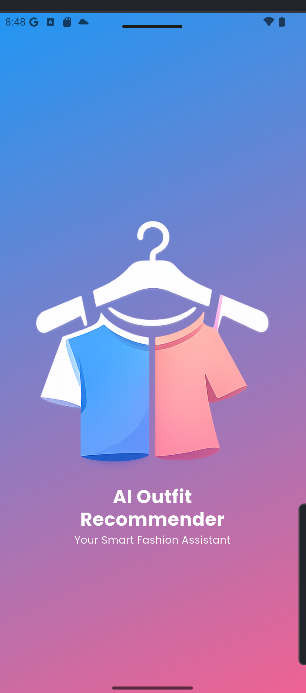
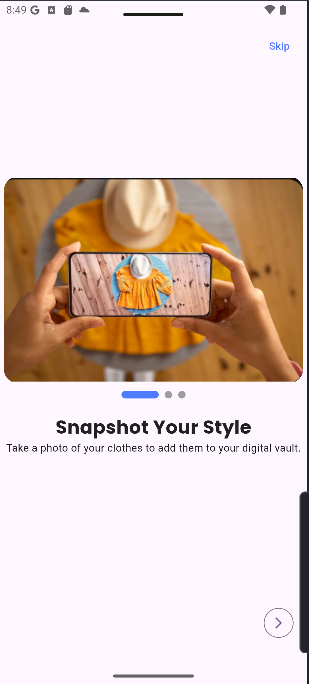
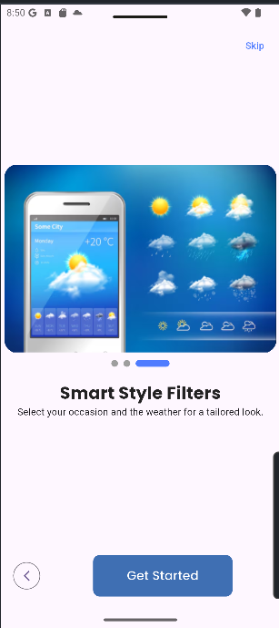
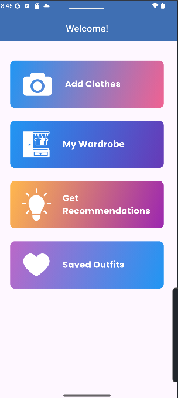
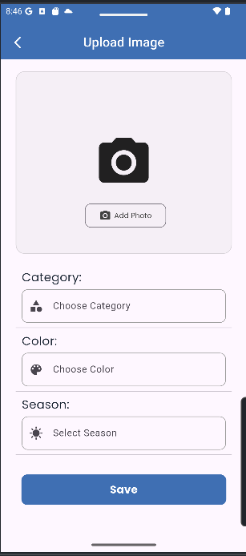
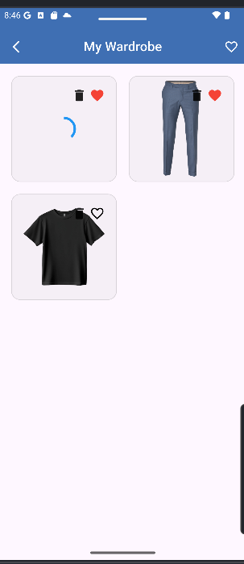
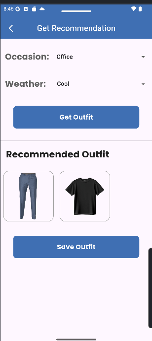
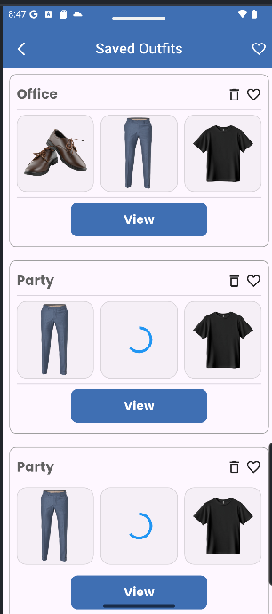
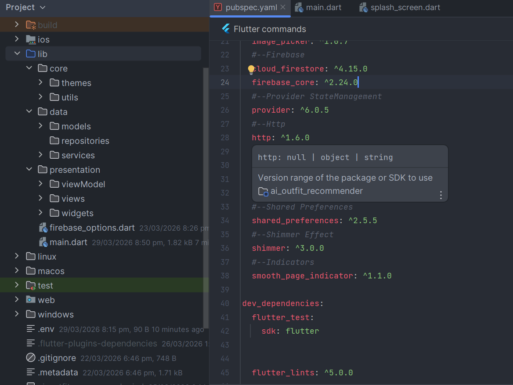

# 🧠 AI Outfit Recommender App

An AI-powered Flutter application that helps users get smart outfit recommendations based on uploaded clothing images. The app uses **Firebase** for backend services and integrates AI to analyze clothing style, color, and category.

---

## 🚀 Features

- 📸 Upload clothing images from camera or gallery  
- ☁️ Store images securely using Firebase Storage  
- 🔥 Save clothing data in Firebase Firestore  
- 🤖 AI-based outfit recommendation system  
- 👕 Detect clothing category (shirt, pants, shoes, etc.)  
- ❤️ Add outfits to favorites  
- 🔐 User Authentication (Login/Signup)  
- 📱 Clean and responsive Flutter UI  

---

## 🛠️ Tech Stack

- Flutter (Dart)
- Firebase Authentication
- Firebase Firestore
- Firebase Storage
- AI API (Gemini)

---

## 📷 Screenshots

## 📱 Splash Screen

## 📱 Onboarding Screen

## 📱 Home Screen

## 📱 Add Outfit Screen

## 📱 My Wardrobe Screen

## 📱 Get Recommendation Screen

## 📱 Saved Outfit Screen

## 📱 Folder Structure

## 🎥 Demo Video

[Watch App Demo](https://youtube.com/shorts/kmgmPrCL-hE?si=RAt6Lvlmo-UTWz3B)
